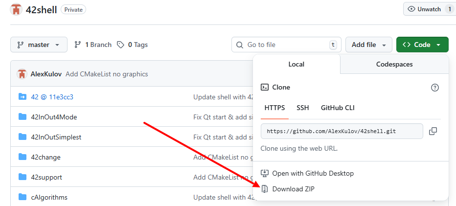
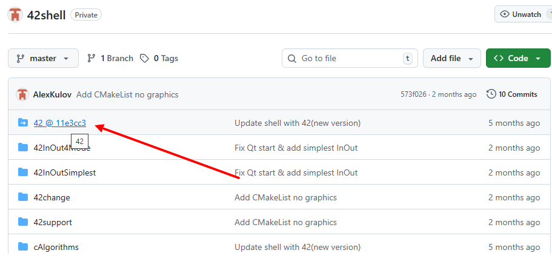
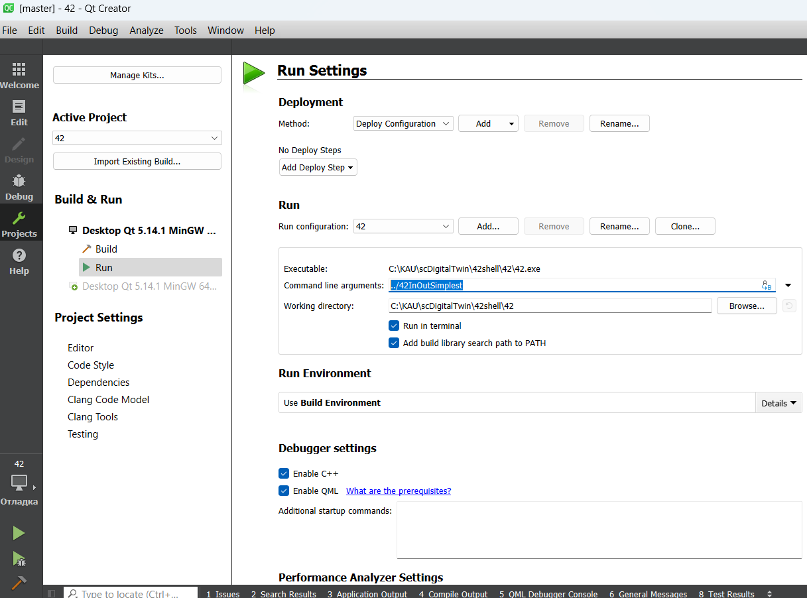

<details>
<summary> README </summary>
# 42shell - это дополнение к 42 для быстрого старта, разработки и тестирования бортовых алгоритмов управления

42shell основан на оригинальном проекте 42, который является его подмодулем.
Важными преимуществами проекта 42 являются 
1) написан на единственном "базовом" языке программирования С и
2) обладает значительными возможностями моделирования: орбитального и углового движения, 
межпланетных перелётов и нескольких аппаратов одновременно 
Более подробно https://github.com/ericstoneking/42

## Структура репозитория
```
-- 42shell
    |-- 42
    |   |-- Contains a origin 42 repo
    |-- 42change
    |   |-- Contains a change 42 code files like 42 strucure
    |-- 42support
    |   |-- Contains freeglut and glew library
    |   |-- Contains code files (QtSource) only Qt lib (Qt5 m.b. more)
    |   |-- Contains qt project file for build from ../42 folder
    |-- shInOut
    |   |-- Like 42/InOut, but demo example for 42shell repo
    |-- 42add
    |   |-- Specific programm models for shell42, but not work without orig 42
	|-- img
    |   |-- just picture for readme
```

## Предпосылки

1) загрузите этот репозиторий на свой компьютер с подмодулем 42
    
а) через командную строку (предполагает установку git):    
git clone --recursive https://github.com/AlexKulov/42shell.git   
   
б) через сайт. Скачайте архив репозитория   
   
распакуйте полученный архив в нужную директорию. При этом папка 42 будет пустая.   
Чтобы скачать содержимое папки 42, перейдите в Проект 42 по ссылке   
   
И также скачайте его (обратите внимание, что [хэш коммита совпадает](img/DownLoadRepo3.png))   
Вам осталось распаковать полученный архив 42 в соотвествтующую папку [42](img/DownLoadRepo1.png)
   
2) установите на компьютер Qt (я использовал Qt5.12).    
**Only OS Windows**: При установке Qt5 (м.б. Qt6) обязательно добавьте компилятор 
MinGW 32(64)-bit   
**Only OS Linux(Ubuntu 18)**: Установите Qt   

## Быстрый старт для OS Windows/Linux

**Only OS Windows!!!**: скопируйте dll файлы из папок 42support/glew и 42support/freeglut в папку 42 
(чтобы запускать exe-файл, который компилируется в этой папке)   
**OS Windows/Linux(Ubuntu 18)**:   
1) откройте файл 42support/42.pro через Qt Creator, выбирете компилятор MinGW 32-bit 
(это важно, т.к. файлы dll собраны с учётом этого) и нажмите "Подробнее". Далее выбирете директорию 
42support для всех трёх случаев и нажмите конопку "Настроить проект"
** Важно! В пути к 42support не должно быть кириллицы **
 
2) запустите проект на выполнение (слева внизу зелёный треугольник с жуком)
3) на появившемся виджете нажмите кнопку "Старт"

В итоге должна появится 3D графика (42), а также должны начать отрисовываться графики(Qt)   
**Only OS Linux(Ubuntu 18)**: скорее всего работает и на других дистрибутивах Linux
   
## Тестовые примеры 42InOut...

Прежде всего, чтобы работать с 42 нужны файлы исходных данных(ИД). 
Когда запускается 42 по умолчанию он ищет файлы ИД в папке ./InOut.
При быстром старте было именно так, файлы ИД находились в папке 42/InOut
(или просто ./InOut, т.к. исполняемый файл лежит в папке 42).
Для проекта 42shell я разработал несколько новых тестовых примеров.
Вот некотрые из них (находятся в папке shInOut)   
- **42InOut4Mode**: Включает 4 тестовых режима: 3 одноосных (Солнце, надир и цель на Земле)
 и 1 трёхосный - ориентация в LVLH (в русскоязычной терминологии это похоже на 
 орбитальную СК). Логика переключения режимов записана в файле Inp_Cmd.txt:
 сначала КА ориентируется на Солнце осью b3, после входа в тень и потери Солнца ось b3 
переориентируется в надир (это происходит примерно над Атлантикой), при выходе из тени в полутень 
дополняется ориентация осей b1 и b2: b1 по направлению полёта, b2 перпендикулярна плоскости орбиты 
(это LVLH ориентация), затем пролетая над Австралией, КА нацеливает b3 на город Джаяпура 
(Индонезия) с координатами 140.71 градусов в.д. и 2.5 ю.ш. (жёстко прописаны в коде);  
- **42InOutSimplest**: минимально возможный набор файлов ИД: файл аппарата, файл орбиты, файл 
симуляции и файл команд.

### Как выбрать папку с ИД?
**Из консоли**: Если вы делаете это из консоли, просто введите первым параметром адрес новой папки ИД. 
Например, ../42InOutSimplest.

**Из Qt**:
1) открыть вкладку Проекты (слева иконка зелёного ключа)
2) в разделе "Сборка и запуск" выбрать "Запустить" (также в левой части окна)
3) Найти строку для ввода с названием "Параметры командной строки"
4) в командной строке ввести ../42InOut4Mode




Теперь можно запускать программу (опять зелёная кнопка с жуком) и нажать кнопку "Старт".
</details>

<details>
<summary> README EN</summary>
Sorry! (((
</details>