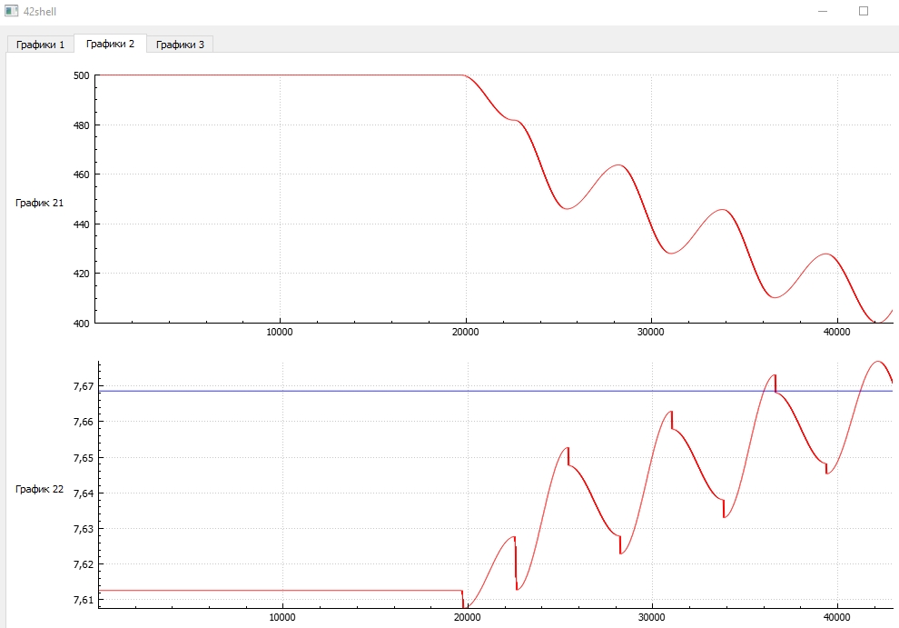
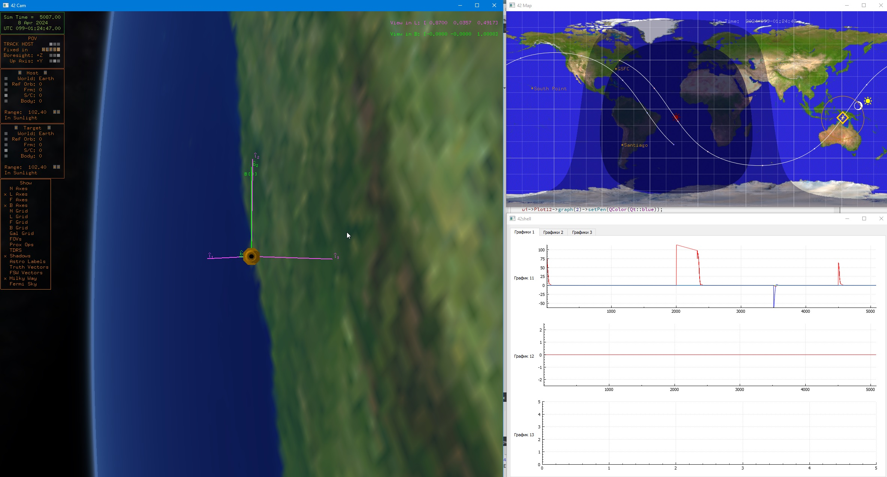
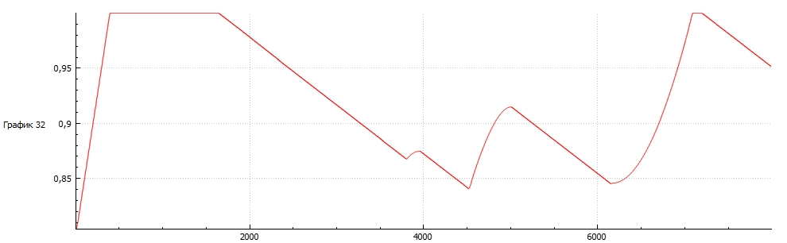

## Rendezvous   
Simulation of rendezvous of two spacecraft: active (500 km) and passive (400 km)
   
   
## 4Mode   
Enables 4 test modes: 3 single-axis (Sun, nadir, and target on Earth)  
and 1 three-axis - orientation in LVLH (in Russian terminology, this is similar to  
orbital coordinate system). The mode switching logic is written in the Inp_Cmd.txt file:  

The spacecraft first aligns its b3 axis with the Sun. After entering the umbra and losing the Sun, the b3 axis  
reorients to the nadir (this occurs approximately over the Atlantic). Upon exiting the umbra into the penumbra,  
the orientation of the b1 and b2 axes is adjusted: b1 is aligned with the flight direction, b2 is perpendicular to the orbital plane  
(this is the LVLH orientation). Then, while flying over Australia, the spacecraft aims b3 at the city of Jayapura  
(Indonesia) with coordinates of 140.71 degrees E and 2.5 degrees S (hardcoded);   
   
   
## Simplest
like 4Mode, but without GUI   
   
## SpsSimple   
Supply Power System simulation. Not exist in native 42    
The plot shows the charge/discharge of the battery
   

## ThrControl8Thr
Demonstration propulsion system operation.   
In particular, three-axis orientation by four thrusters    
Compared to the native 42, added propulsion system, in which:   
1. Thr operation is calculated taking into account the thrust buildup and aftereffect impulse;   
2. Total fuel consumption and the number of ignitions of each thr's are calculated.     
